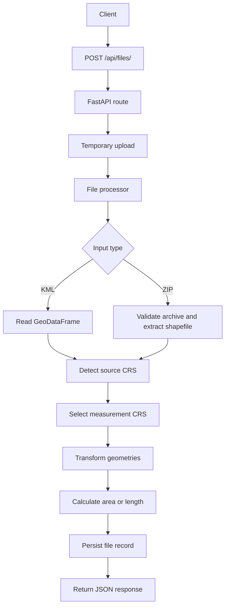

# Geospatial File Measurement API

A FastAPI backend for uploading geospatial files, extracting feature data, handling coordinate reference systems, and calculating area or length measurements.

## Overview

The service accepts:

- `.kml` files
- `.zip` archives containing exactly one Shapefile

For each feature, the API returns geometry metadata, source CRS information, properties, and a measurement when applicable.

## Setup

### Prerequisites

- Python 3.13+
- `pip`

If you are using Windows PowerShell, run the commands below from the project root:

```powershell
cd c:\Users\fk790\OneDrive\Desktop\PROJECTS\geospatial-file-measurement-api
```

### Install dependencies

```powershell
pip install -r requirements.txt
```

### Run locally

Start the API with Uvicorn:

```powershell
uvicorn app.main:app --reload
```

The application is available at:

- `http://127.0.0.1:8000`
- Swagger UI: `http://127.0.0.1:8000/docs`

If `uvicorn` is not available in your shell, use:

```powershell
python -m uvicorn app.main:app --reload
```

### Quick verification

After the server starts, confirm the app is running by opening:

- `http://127.0.0.1:8000`
- `http://127.0.0.1:8000/docs`

Then upload `sample_data/test.kml` from the Swagger UI or by using the curl example in the API section.

### Using Swagger UI

1. Open `http://127.0.0.1:8000/docs`.
2. Find `POST /api/files/`.
3. Click `Try it out`.
4. Choose a file such as `sample_data/test.kml`.
5. Click `Execute`.
6. Review the JSON response returned by the API.

### Run tests

```powershell
pytest -v
```

## API

### 1. Upload a geospatial file

`POST /api/files/`

Upload a supported `.kml` file or `.zip` archive.

Use this endpoint when testing through Swagger UI or when sending a multipart upload request from curl.

Example request:

```bash
curl -X POST "http://127.0.0.1:8000/api/files/" \
  -H "accept: application/json" \
  -H "Content-Type: multipart/form-data" \
  -F "file=@sample_data/test.kml"
```

Example response:

```json
{
  "id": "14edff87-30e5-423c-ae5e-cd673ad2f386",
  "filename": "test.kml",
  "feature_count": 3,
  "crs": "EPSG:4326",
  "measurement_crs": "EPSG:32643",
  "geometry_types": ["Point", "LineString", "Polygon"],
  "status": "COMPLETED",
  "measurements": [
    {
      "feature_id": 0,
      "geometry_type": "Point",
      "measurement": null,
      "unit": null
    }
  ]
}
```

In Swagger UI, the same upload flow is available from the `POST /api/files/` endpoint.
The full upload response also includes the per-feature measurements.

### 2. Get file metadata

`GET /api/files/{file_id}/`

Example request:

```bash
curl "http://127.0.0.1:8000/api/files/abc123"
```

Example response:

```json
{
  "id": "abc123",
  "filename": "survey.kml",
  "feature_count": 120,
  "crs": "EPSG:4326",
  "measurement_crs": "EPSG:32643",
  "status": "COMPLETED"
}
```

### 3. Get measurements

`GET /api/files/{file_id}/measurements/`

Example request:

```bash
curl "http://127.0.0.1:8000/api/files/abc123/measurements"
```

Example response:

```json
{
  "file_id": "abc123",
  "filename": "survey.kml",
  "measurement_crs": "EPSG:32643",
  "feature_count": 2,
  "measurements": [
    {
      "feature_id": 0,
      "geometry_type": "Polygon",
      "measurement": 1201683.91,
      "unit": "square_meters"
    }
  ]
}
```

### 4. Health check

`GET /`

Example response:

```json
{
  "message": "Geospatial File Measurement API is running"
}
```

## Architecture



### Application structure

The codebase is organized by responsibility:

- `app/main.py` initializes the FastAPI application
- `app/api/routes/files.py` exposes the HTTP endpoints
- `app/services/file_processor.py` reads KML and Shapefile inputs
- `app/services/crs.py` selects the measurement CRS
- `app/services/measurement.py` calculates geometry measurements
- `app/services/serialization.py` prepares JSON-safe values
- `app/services/storage.py` persists file records

### File-processing flow

1. The client uploads a `.kml` or `.zip` file.
2. The file is stored temporarily in `uploads/`.
3. The processor reads the geospatial content into a GeoDataFrame.
4. The response metadata and measurements are generated.
5. The temporary upload is removed after processing.
6. The final record is stored in `data/files.json`.

### Measurement calculation flow

1. The geometry type is inspected.
2. If the CRS is geographic, a projected CRS is selected for measurement.
3. Polygons and multipolygons are measured by area.
4. LineStrings and MultiLineStrings are measured by length.
5. Points are returned without a measurement.

### CRS handling

The application avoids measuring directly in geographic coordinates such as `EPSG:4326`.
Instead, it selects a suitable projected CRS, typically a UTM zone, and transforms geometries before calculating area or length.

## Design Decisions

### FastAPI

FastAPI was chosen for its clean request handling, strong typing, and built-in OpenAPI documentation.

### GeoPandas and Shapely

GeoPandas simplifies file ingestion and CRS-aware geometry handling, while Shapely supports geometry inspection and measurement-friendly operations.

### File-based persistence

The project stores processed file metadata in JSON because the assignment focuses on API and geospatial processing rather than database infrastructure.

### Temporary ZIP extraction

ZIP archives are extracted into a temporary directory and validated before reading. This avoids leaving intermediate Shapefile components on disk and reduces security risk.

### Strict Shapefile validation

The API rejects ZIP archives that are ambiguous or incomplete, including archives with multiple `.shp` files or missing required Shapefile components.

### Measurement CRS selection

A projected CRS is selected automatically for accurate metric measurements. An alternative would be to let the client choose the CRS, but that adds unnecessary complexity for this assignment.

## Learning

Through this project, I worked with:

- FastAPI backend development
- REST API design
- Multipart file uploads
- GeoPandas and Shapely
- CRS handling and measurement conversion
- KML and Shapefile processing
- Secure ZIP extraction
- JSON serialization of geospatial data
- Automated testing with Pytest

## Future Scope

For a production-scale version, the system could be extended with:

- PostgreSQL + PostGIS for geospatial persistence
- Background processing for large uploads
- GeoJSON and GeoPackage support
- User-selectable measurement CRS
- Authentication and authorization
- Structured logging and monitoring
- File-size and resource limits
- Pagination for large feature collections

## Supported inputs

- `.kml`
- `.zip` containing one Shapefile with `.shp`, `.shx`, `.dbf`, and `.prj`

## Supported measurements

- Polygon / MultiPolygon: area
- LineString / MultiLineString: length
- Point: no measurement

## Project structure

```text
app/
  main.py
  api/routes/files.py
  services/
    crs.py
    file_processor.py
    measurement.py
    serialization.py
    storage.py

data/files.json
sample_data/test.kml
tests/
uploads/
```

## Author

Faizan Khan

B.Tech - Computer Engineering

Z.H. College of Engineering and Technology, Aligarh Muslim University
